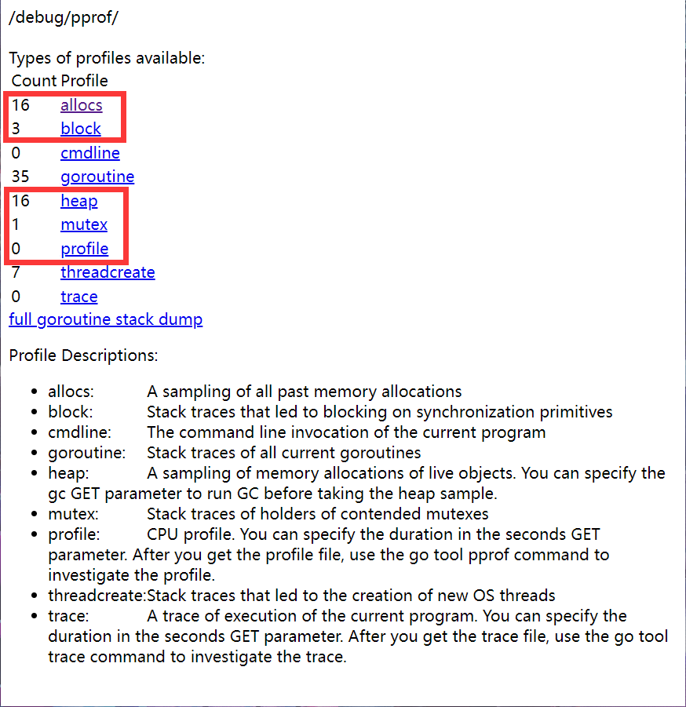
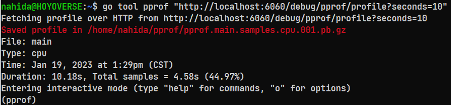
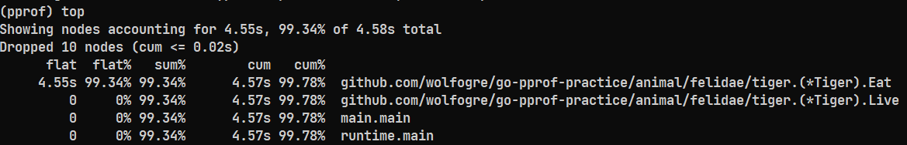
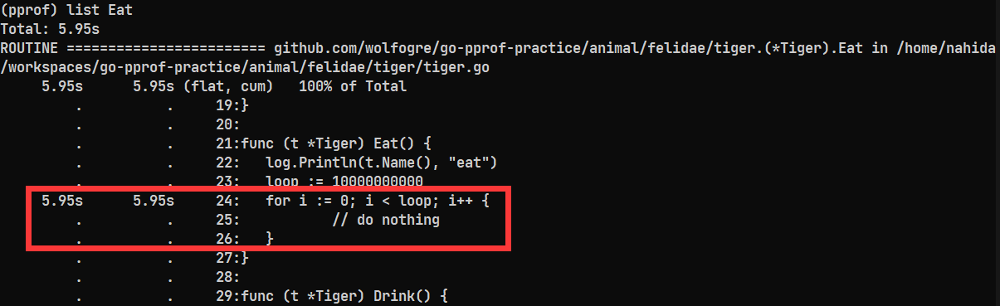
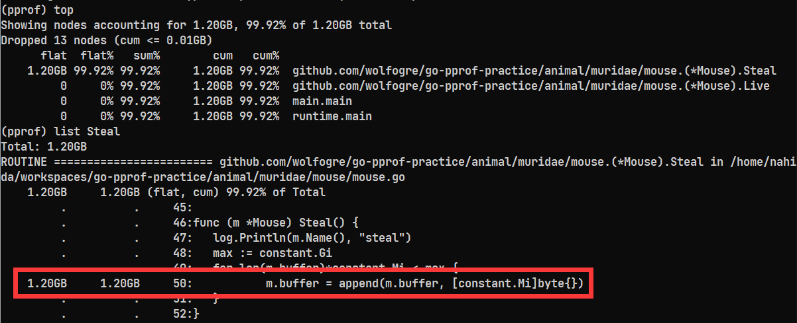
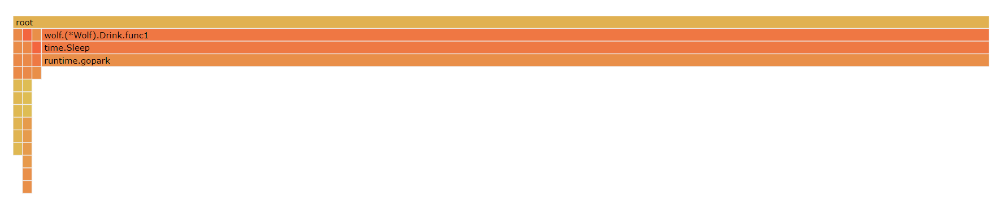
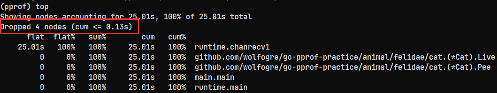

# Go语言性能调优

- 如何编写更简洁清晰的代码；
- 常用的Go语言程序优化手段；
- 熟悉Go程序性能分析工具；
- 了解工程中性能优化的原则和流程；

## 1 高质量编程

编写的代码能够达到正确可靠、简介清晰的目标，比如各种边界条件的考虑、异常情况处理以及可读性和维护性等方面。可以参考Go语言开发者[Dave Cheney](https://dave.cheney.net/about)的[The Zen of Go](https://the-zen-of-go.netlify.app/)。

如何编写高质量的Go代码，可以从以下几个方面考虑：

- 代码格式
- 注释
- 命名规范
- 控制流程
- 错误和异常处理

### 1.1 代码格式

官方提供了自动格式化工具`gofmt`以及依赖包管理工具`goimports`等，能够让Go语言代码风格统一。

### 1.2 注释

注释应该遵循的规范：

- 注释应该解释代码的作用（注释公共符号）；

- 注释应该揭示代码如何做的（注释实现过程）；

- 注释应该解释代码实现的原因（解释外部因素、提供额外的上下文）；

- 注释应该解释代码什么情况会出错（解释代码的限制条件）。

公共符号始终要注释：包中声明的每个公共符号（变量、常量、函数、结构体等）都需要添加注释；任何及不明显也不简短的公共功能必须注释；对库中的任何函数都必须进行注释；实现接口的方法可以不需要注释。

**小结：代码是最好的注释，注释应该提供代码为表达出的上下文信息。**

### 1.3 命名规范

变量（variable）命名规范

- 缩略词全部大写，当且仅当其位于变量开头且不需要导出时小写，例如`ServeHTTP`、`xmlHTTPRequest`；
- 变量被使用的地方越远，携带的上下文信息则需要更多，例如全局变量等；

函数（function）命名规范

- 函数名不携带包名的上下文信息；
- 函数名尽量简短；
- 当名为`foo`的包的某个函数返回`Foo`类型时可以省略类型信息，返回其他类型`T`时可以在函数中加入类型信息；

举例：http 包中创建服务的函数

```go
func Serve(l net.Listener, handler Handler) error // Good
func ServeHTTP(l net.Listener, handler Handler) error // Bad
```

包（package）命名规范

- **必须**只由小写字母组成，不包含下划线等字符；
- **必须**包含一定的上下文信息，例如`schema`、`task`等；
- **必须**不能与标准库同名；
- **尽量**不使用常用变量名作为包名，例如使用`bufio`而不是`buf`；
- **尽量**使用单数而不是复数，例如使用`encoding`而不是`encodings`；
- **尽量**谨慎地使用缩写，例如使用`fmt`而不是`format`。

### 1.4 控制流程

- 线性原理，避免复杂嵌套，保证正常流程，如果`if`语句中两个分支都包含`return`语句，则可以去掉冗余的`else`；

- 尽量保证正常代码路径为最小缩进，优先处理错误情况/特殊情况，尽早返回或继续循环来减少嵌套；

### 1.5 错误和异常处理

简单错误（仅出现一次的错误，在其他地方不需要捕获）

- 优先使用`errors.New()`创建匿名变量来直接表示简单报错；

- 如果有格式化需求则使用`fmt.Errorf`来格式化；

复杂错误（错误的跟踪链）

- 错误的`Wrap`提供了一个`error`的嵌套能力，从而生成一个`error`跟踪链；

- 在`fmt.Errorf`中使用`%w`来讲一个错误关联至错误链中；

错误判定

- 判定一个错误是否为特定错误，使用`errors.Is`而不是`==`；

- 获取错误链中特定种类的错误，使用`errors.As`；

PANIC

- 不建议在业务代码中使用`panic`；
- 调用函数不包含`recover`会造成程序崩溃；
- 问题可以被屏蔽或解决时，应该使用`error`代替`panic`；
- 在程序启动阶段发生不可逆转的错误时可以在初始化方法或者`main`函数中使用`panic`；

RECOVER

- `recover`只能在被`defer`函数中使用，`defer`语句是后进先出；

- `recover`不能嵌套生效；

- `recover`只能在当前`goroutine`生效；
- 如果需要更多的上下文信息，可以`recover`后使用`debug.Stack()`在log中记录当前的调用栈，方便原因查找；

## 2 性能调优建议

如何评估代码性能：Go语言提供了支持基准性能测试的benchmark工具。

### 2.1 Slice

切片本质是一个数组片段的描述，包括数组指针、片段长度以及片段容量：

```go
type slice struct {
    array unsafe.Pointer // 数组指针
    len   int            // 片段长度
    cap   int            // 片段容量
}
```

切片操作并不复制切片指向的元素，创建一个新的切片会复用原来切片的底层数组。

- `slice`预分配内存，切片容量足够时直接讲元素放入对应的内存，容量不足时会先进行一次扩容操作，因此尽可能在使用`make`初始化切片时提供容量信息；

- 大内存释放问题，由于在已有切片的基础上创建切片时，不会创建新的底层数组，新的切片依然会引用原底层数组，当原切片较大时，就会造成内存的浪费，我们可以使用`copy`替代`re-slice`：

  ```go
  // re-slice
  func GetLastBySlice(origin []int) []int {
      return origin[len(origin)-2:]
  }
  
  // copy
  func GetLastByCopy(origin []int) []int {
      result := make([]int, 2)
      copy(result, origin[len(origin)-2:])
      return result
  }
  ```

### 2.2 Map

`Map`的性能调优方向和`Slice`类似，同样从预分配内存方向考虑：在不断向`Map`中添加元素时会触发扩容，提前分配好空间可以减少内存的拷贝以及Rehash的消耗，因此根据实际需求提前预估需要的空间是必要的。

### 2.3 String

使用`strings.Builder`或者`bytes.Buffer`进行字符串拼接的性能远远由于直接使用`+`进行拼接，性能表现上`string.Buffer`更快，其原因在于：

- 字符串在Go语言中是不可变类型，因此占用的内存大小是固定的；

- 使用`+`每次都会重新分配内存；

- `strings.Builder`和`bytes.Buffer`的底层都是`[]byte`数组，内存分配策略不需要每次拼接都重新分配内存；

- `bytes.Buffer`在将`[]byte`数组转化为字符串时重新申请了一块空间，而`strings.Builder`是直接将`[]byte`数组转化为了字符串类型返回：

  ```go
  // bytes.Buffer
  func (b *Buffer) String() string {
      if b == nil {
          return "<nil>"
      }
      return string(b.buf[b.off:])
  }
  // strings.Builder
  func (b *Builder) String() string {
      return *(*string)(unsafe.Pointer(&b.buf))
  }
  ```

在已知拼接的字符串长度的情况下，可以使用`Grow(size)`方法进一步提高字符串拼接的性能。

### 2.4 Struct

使用空结构体节省内存：空结构体`struct{}`实例不占据如何的内存空间，可以作为各种场景下的占位符：

```go
func EmptyStructMap(n int) {
    m := make(map[int]struct{})
    for i := 0; i < n; i++ {
        m[i] = struct{}{}
    }
}

func BoolMap(n int) {
    m := make(map[int]bool)
    for i := 0; i < n; i++ {
        m[i] = false
    }
}
```

使用场景：

- 实现`Set`可以考虑用`Map`代替，例如：[golang-set](https://github.com/deckarep/golang-set/blob/main/threadunsafe.go)；
- 只需要用到`Map`的`KEY`，而不需要`VALUE`的场景；

### 2.5 Atomic

在多线程编程场景中，原子操作的性能比互斥锁更优：

```go
// 原子操作
type atomicCounter struct {
    i int32
}
func AtomicAddOne(c *atomicCounter) {
    atomic.AddInt32(&c.i, 1)
}
// 加锁操作
type mutexCounter struct {
    i int32
    m sync.Mutex
}
func MutexAddOne(c *mutexCounter) {
    c.m.Lock()
    c.i++
    c.m.Unlock()
}
```

其原因在于：

- 锁的实现是通过操作系统实现的，属于系统调用，而原子操作是通过硬件实现的，因此效率更高；
- `sync.Mutex`用于保护一段逻辑，不仅仅保护一个变量；
- 对于非数值操作，可以使用`atomic.Value`，能承载一个`interface{}`；

## 3 性能调优实战

性能调优原则：

- 要依赖数据而不是猜测；
- 要定位最大瓶颈而不是细枝末节；
- 不要过早优化也不要过度优化；

### 3.1 性能分析工具pprof

- 可以知道应用在什么地方耗费了多少CPU资源和内存资源；
- 可以进行可视化的性能数据分析；

### 3.2 项目分析

[项目地址](https://github.com/wolfogre/go-pprof-practice)

```go
func main() {
	log.SetFlags(log.Lshortfile | log.LstdFlags)
	log.SetOutput(os.Stdout)

	runtime.GOMAXPROCS(1)              // 限制CPU使用数
	runtime.SetMutexProfileFraction(1) // 开启锁调用跟踪
	runtime.SetBlockProfileRate(1)     // 开启阻塞调用跟踪

	go func() {
		// 启动 HTTP server
		if err := http.ListenAndServe(":6060", nil); err != nil {
			log.Fatal(err)
		}
		os.Exit(0)
	}()
	// ...
}
```

访问：http://localhost:6060/debug/pprof/



#### 3.2.1 CPU性能排查

采集10秒的数据

```shell
go tool pprof "http://localhost:6060/debug/pprof/profile?seconds=10"
```



**top命令**

- flat：当前函数本身的执行耗时
- flat%：flat在CPU总时间的占比
- sum%：上面每一行的flat%总和
- cum：当前函数本身加上其调用函数的总耗时
- cum%：cum在CPU总时间的占比



当函数没有调用其它函数时，flat和cum相等；

当flat等于0时，函数只有其它函数的调用；

**list命令**

由`top`命令的结果可知，`Eat`方法占用了很大的CPU资源，我们可以使用`list Eat`命令对`Eat`方法进行排查：



#### 3.2.2 Heap堆内存排查

```shell
go tool pprof "http://localhost:6060/debug/pprof/heap"
```

和CPU排查的方法类似：使用`top`和`list`进行问题定位



#### 3.2.3 协程排查

可以添加`-http`参数进行可视化分析：

```shell
go tool pprof -http=:8080 "http://localhost:6060/debug/pprof/heap"
```

在`View`中切换为`Flame Graph`，可以更直观地进行问题排查



排查到`wolf`下的`Drink`方法存在问题：

```go
func (w *Wolf) Drink() {
	log.Println(w.Name(), "drink")
    // 问题
	for i := 0; i < 10; i++ {
		go func() {
			time.Sleep(30 * time.Second)
		}()
	}
}
```

#### 3.2.4 Mutex排查

```shell
go tool pprof -http=:8080 "http://localhost:6060/debug/pprof/mutex"
```

排查问题：

```go
func (w *Wolf) Howl() {
	log.Println(w.Name(), "howl")
	// 问题
	m := &sync.Mutex{}
	m.Lock()
	go func() {
		time.Sleep(time.Second)
		m.Unlock()
	}()
	m.Lock()
}
```

#### 3.2.5 阻塞排查

```shell
go tool pprof "http://localhost:6060/debug/pprof/block"
```



`pprof`通过过滤策略会忽略一些点。