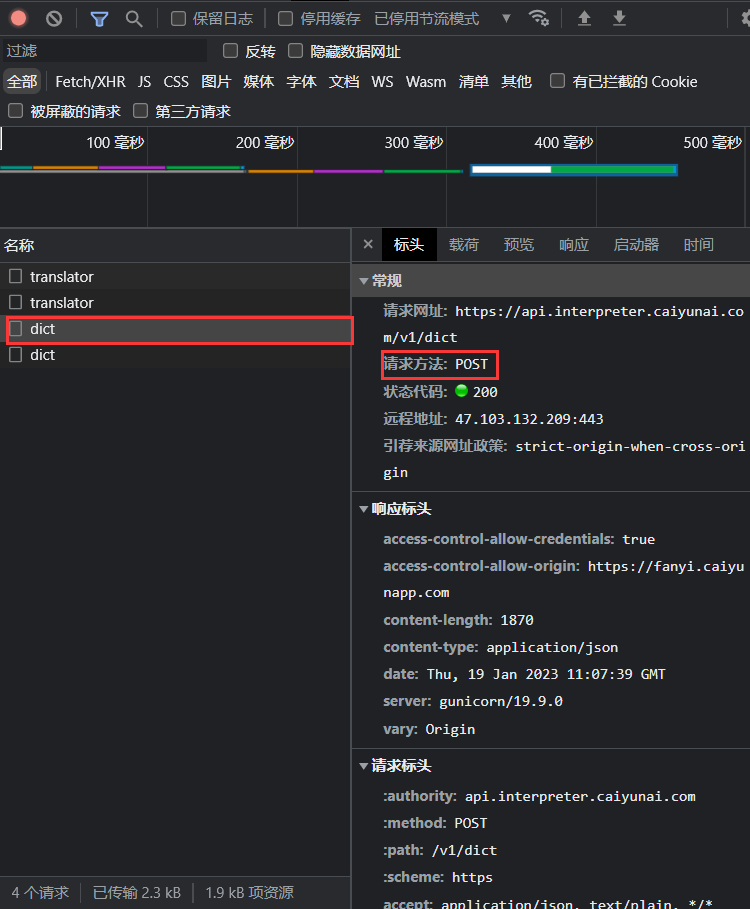
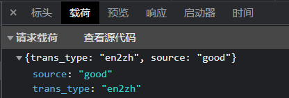
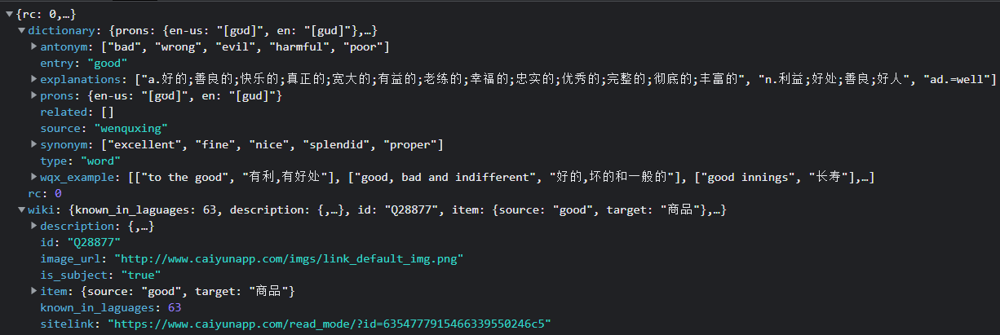

# 在线词典

## 1 抓包

https://fanyi.caiyunapp.com/

随意输入一个英文单词点击翻译，在开发者工具中找到下图中的`POST`请求：



该请求包含一个JSON格式数据：





在开发者工具中复制`cUrl`信息：

```shel
curl 'https://api.interpreter.caiyunai.com/v1/dict' \
  -H 'authority: api.interpreter.caiyunai.com' \
  -H 'accept: application/json, text/plain, */*' \
  -H 'accept-language: zh-CN,zh;q=0.9' \
  -H 'app-name: xy' \
  -H 'content-type: application/json;charset=UTF-8' \
  -H 'device-id;' \
  -H 'origin: https://fanyi.caiyunapp.com' \
  -H 'os-type: web' \
  -H 'os-version;' \
  -H 'referer: https://fanyi.caiyunapp.com/' \
  -H 'sec-ch-ua: "Not_A Brand";v="99", "Google Chrome";v="109", "Chromium";v="109"' \
  -H 'sec-ch-ua-mobile: ?0' \
  -H 'sec-ch-ua-platform: "Windows"' \
  -H 'sec-fetch-dest: empty' \
  -H 'sec-fetch-mode: cors' \
  -H 'sec-fetch-site: cross-site' \
  -H 'user-agent: Mozilla/5.0 (Windows NT 10.0; Win64; x64) AppleWebKit/537.36 (KHTML, like Gecko) Chrome/109.0.0.0 Safari/537.36' \
  -H 'x-authorization: token:qgemv4jr1y38jyq6vhvi' \
  --data-raw '{"trans_type":"en2zh","source":"good"}' \
  --compressed
```

在https://curlconverter.com/中生成Go语言代码：

```go
client := &http.Client{}
var data = strings.NewReader(`{"trans_type":"en2zh","source":"good"}`)
// 创建HTTP请求
req, err := http.NewRequest("POST", "https://api.interpreter.caiyunai.com/v1/dict", data)
if err != nil {
    log.Fatal(err)
}
// 设置请求头
req.Header.Set("authority", "api.interpreter.caiyunai.com")
req.Header.Set("accept", "application/json, text/plain, */*")
req.Header.Set("accept-language", "zh-CN,zh;q=0.9")
req.Header.Set("app-name", "xy")
req.Header.Set("content-type", "application/json;charset=UTF-8")
req.Header.Set("device-id", "")
req.Header.Set("origin", "https://fanyi.caiyunapp.com")
req.Header.Set("os-type", "web")
req.Header.Set("os-version", "")
req.Header.Set("referer", "https://fanyi.caiyunapp.com/")
req.Header.Set("sec-ch-ua", `"Not_A Brand";v="99", "Google Chrome";v="109", "Chromium";v="109"`)
req.Header.Set("sec-ch-ua-mobile", "?0")
req.Header.Set("sec-ch-ua-platform", `"Windows"`)
req.Header.Set("sec-fetch-dest", "empty")
req.Header.Set("sec-fetch-mode", "cors")
req.Header.Set("sec-fetch-site", "cross-site")
req.Header.Set("user-agent", "Mozilla/5.0 (Windows NT 10.0; Win64; x64) AppleWebKit/537.36 (KHTML, like Gecko) Chrome/109.0.0.0 Safari/537.36")
req.Header.Set("x-authorization", "token:qgemv4jr1y38jyq6vhvi")
// 发起请求
resp, err := client.Do(req)
if err != nil {
    log.Fatal(err)
}
defer resp.Body.Close()
// 读取响应
bodyText, err := ioutil.ReadAll(resp.Body)
if err != nil {
    log.Fatal(err)
}
fmt.Printf("%s\n", bodyText)
```

## 2 请求的序列化

首先构造一个请求结构体：

```go
type DictRequest struct {
	TransType string `json:"trans_type"`
	Source    string `json:"source"`
	UserID    string `json:"user_id"`
}
```

使用`json`包将结构体实例转换为JSON字符串序列：

```go
request := DictRequest{TransType: "en2zh", Source: "good"}
buf, err := json.Marshal(request)
if err != nil {
    log.Fatal(err)
}
var data = bytes.NewReader(buf)
```

## 3 响应的反序列化

将JSON字符串转化为Go结构体：https://oktools.net/json2go

```go
type DictResponse struct {
	Rc   int `json:"rc"`
	Wiki struct {
		KnownInLaguages int `json:"known_in_laguages"`
		Description     struct {
			Source string      `json:"source"`
			Target interface{} `json:"target"`
		} `json:"description"`
		ID   string `json:"id"`
		Item struct {
			Source string `json:"source"`
			Target string `json:"target"`
		} `json:"item"`
		ImageURL  string `json:"image_url"`
		IsSubject string `json:"is_subject"`
		Sitelink  string `json:"sitelink"`
	} `json:"wiki"`
	Dictionary struct {
		Prons struct {
			EnUs string `json:"en-us"`
			En   string `json:"en"`
		} `json:"prons"`
		Explanations []string      `json:"explanations"`
		Synonym      []string      `json:"synonym"`
		Antonym      []string      `json:"antonym"`
		WqxExample   [][]string    `json:"wqx_example"`
		Entry        string        `json:"entry"`
		Type         string        `json:"type"`
		Related      []interface{} `json:"related"`
		Source       string        `json:"source"`
	} `json:"dictionary"`
}
```

## 4 结果输出

首先判断请求响应码是否是`200`：

```go
if resp.StatusCode != http.StatusOK {
    log.Fatal("Bad StatusCode:", resp.StatusCode, "body", string(bodyText))
}
```

然后输出翻译结果：

```go
fmt.Println(word, "UK:", dictResponse.Dictionary.Prons.En, "US:", dictResponse.Dictionary.Prons.EnUs)
for _, item := range dictResponse.Dictionary.Explanations {
    fmt.Println(item)
}
```

